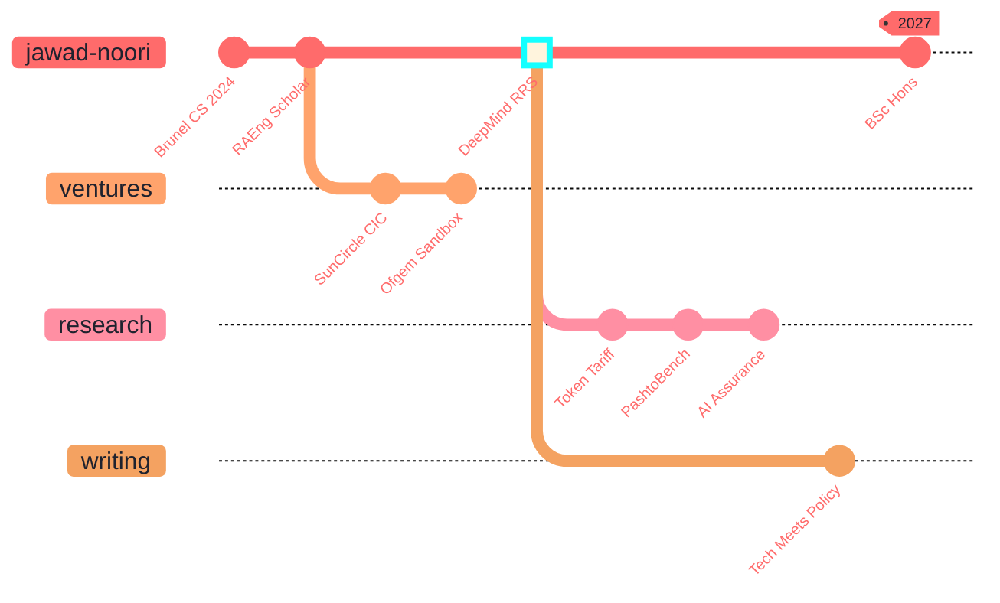

 

<table>
<tr>
<td align="center" width="110">

 <strong>Java</strong>
</td>
<td align="center" width="110">

 <strong>Python</strong>
</td>
<td align="center" width="110">

 <strong>JavaScript</strong>
</td>
<td align="center" width="110">

 <strong>C#</strong>
</td>
<td align="center" width="110">

 <strong>HTML</strong>
</td>
<td align="center" width="110">

 <strong>CSS</strong>
</td>
<td align="center" width="110">

 <strong>React</strong>
</td>
</tr>
<tr>
<td align="center" width="110">

 <strong>Figma</strong>
</td>
<td align="center" width="110">

 <strong>Tailwind CSS</strong>
</td>
<td align="center" width="110">

 <strong>Bootstrap</strong>
</td>
<td align="center" width="110">

 <strong>Spring Boot</strong>
</td>
<td align="center" width="110">

 <strong>MongoDB</strong>
</td>
<td align="center" width="110">

 <strong>MySQL</strong>
</td>
<td align="center" width="110">

 <strong>PostgreSQL</strong>
</td>
</tr>
<tr>
<td align="center" width="110">

 <strong>Git</strong>
</td>
<td align="center" width="110">

 <strong>GitHub</strong>
</td>
<td align="center" width="110">

 <strong>VS Code</strong>
</td>
<td align="center" width="110">

 <strong>Visual Studio</strong>
</td>
<td align="center" width="110">

 <strong>Eclipse</strong>
</td>
<td align="center" width="110">

 <strong>Raspberry Pi</strong>
</td>
<td align="center" width="110">

 <strong>Arduino</strong>
</td>
</tr>
</table>

 
 

 
 

&nbsp;&nbsp;&nbsp;

&nbsp;&nbsp;&nbsp;

 
 
